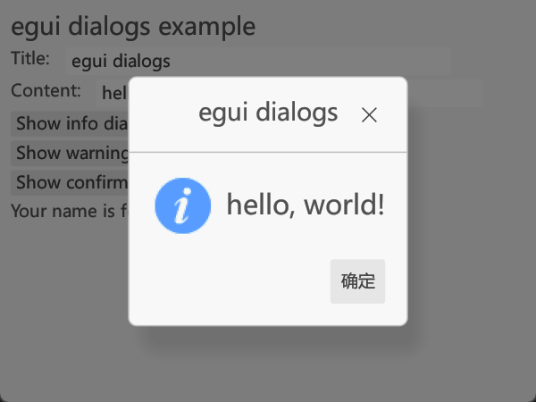

# egui_dialogs

Platform-agnostic, customizable dialogs for egui library.



## Quick start

### Run the example

```bash
# cd into the crate directory
cargo run --example dialogs
```

### Basic usage

Install the crate:

```bash
cargo add egui_dialogs
```

Then add a `Dialogs` field to your `App` struct:

```rust
use egui_dialogs::Dialogs;

pub struct MyApp<'a> {
    // ... your other app states
    dialogs: Dialogs<'a>,
}
```

Then somewhere in your `App::update` function:

```rust
impl MyApp<'_> {
    // ... your other app logic
    
    pub fn update(&mut self, ctx: &egui::Context) {
        self.dialogs.show(ctx);
        
        // ... your other rendering logic
    }
}
```

And when you want to show a dialog:

```rust
self.dialogs.info("Information", "This is an info dialog");
```

### Handle reply

Use `DialogDetails` struct to build
a dialog with custom attributes.

The following is an example to comfirm a window close request:

```rust
use std::{cell::RefCell, rc::Rc};

use egui_dialogs::{DialogDetails, StandardReply};

// in your app state
pub allow_to_close: Rc<RefCell<bool>>,
// and initialize it with false

// when received a close request in the update function
if ctx.input(|i| i.viewport().close_requested()) {
    let ctx = ctx.clone();
    let allow_to_close = Rc::clone(&self.allow_to_close);

    if *allow_to_close.borrow() {
        // run your close logic
    } else {
        // build and show a confirm dialog
        DialogDetails::confirm("Close", "Are you sure you want to close the window?")
            .on_reply(move |res| {
                if res == StandardReply::Ok {
                    *allow_to_close.borrow_mut() = true;
                    ctx.send_viewport_cmd(egui::ViewportCommand::Close);
                }
            })
            .show(&mut self.dialogs);
    }
}
```

## Customization

### Customize standard dialog

You can show a customized dialog based on the standard dialogs:

```rust
use egui::include_image;
use egui_dialogs::{DialogDetails, StandardDialog, StandardReply};

let standard_dialog = StandardDialog::info("Information", "Now you can customize the dialog!")
    .buttons(vec![
        // use the standard buttons
        StandardReply::Yes.into(),
        // or add custom buttons with specific replies
        ("What?".into(), StandardReply::No)
    ])
    .image(include_image!("assets/info.svg"));

DialogDetails::new(standard_dialog)
    .on_reply(|res| {
        match res {
            StandardReply::Yes => println!("That's great!"),
            StandardReply::No => println!("Emm...maybe you can try to see the example?"),
            _ => panic!("I've never added such a reply!")
        }
    })
    .show(&mut self.dialogs);
```

### Customize dialog appearance and behavior

To show a completely customized dialog, you can first design your dialog state struct like this:

```rust
pub struct NameConfirmDialog {
    name: String,
}
```

Then implement the `Dialog` trait to implement dialog logic
with a generic type parameter to specify the dialog reply type:

```rust
use egui_dialogs::{Dialog, dialog_window, DialogContext};

impl Dialog<String> for NameConfirmDialog {
  fn show(&mut self, ctx: &egui::Context, dctx: &DialogContext) -> Option<String> {
    // return None if the user hasn't replied
    let mut res = None;

    // draw the dialog
    dialog_window(ctx, dctx, "Confirm name")
      .show(ctx, |ui| {
        ui.label("What's your name: ");
        ui.text_edit_singleline(&mut self.name);
        if ui.button("Done").clicked() {
          // set the reply and end the dialog
          res = Some(self.name.clone());
        }
      });
      
    res
  }
}
```

The `dialog_window` function is a helper function
to draw a suggested dialog window with a title and a close button.

Now you can show your customized dialog:

```rust
DialogDetails::new(NameConfirmDialog { name: "".into() })
    .on_reply(|res| {
        println!("Your name is {}", res);
    })
    .show(&mut self.dialogs);
```
